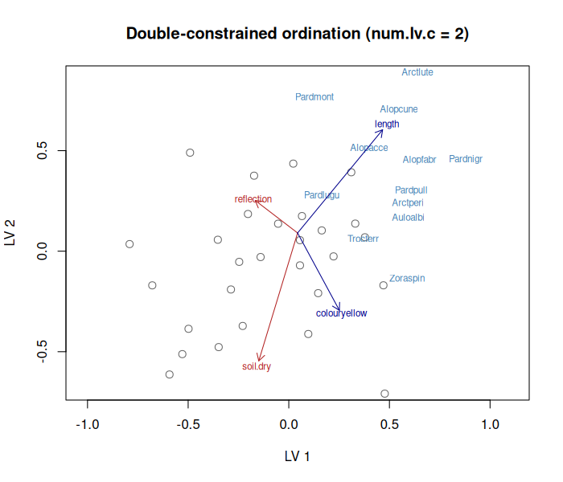
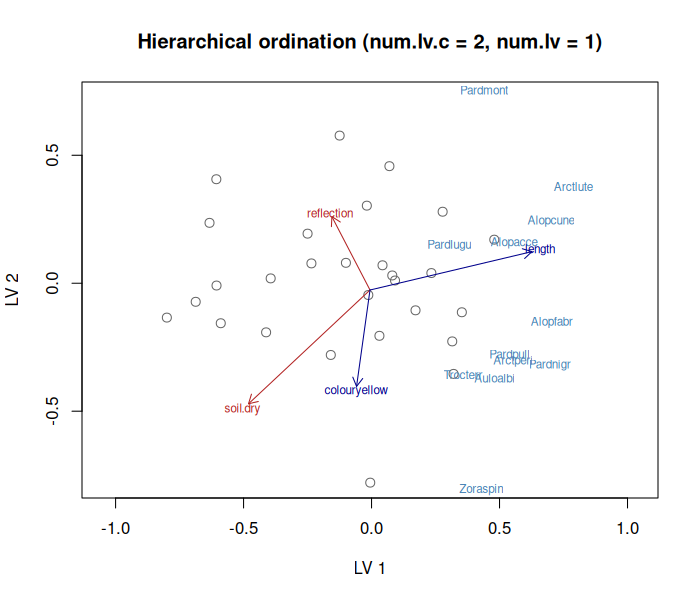

# gllvm

`gllvm` is an R package for analysing multivariate ecological data with Generalized Linear Latent Variable Models (GLLVM).
Estimation is performed using maximum likelihood estimation, together with either variational approximation (VA) or Laplace approximation (LA) method to approximate the marginal likelihood.

# Installation

From CRAN you can install the package using:
```
install.packages("gllvm")
```
Or the development version of `gllvm` from github with the help of `devtools` package using:
```
devtools::install_github("JenniNiku/gllvm")
```

# Getting started

For getting started with `gllvm` we recommend to read vignette [Analysing multivariate abundance data using gllvm](https://jenniniku.github.io/gllvm/articles/vignette1.html)
or introductions for using `gllvm` for [ordination](https://jenniniku.github.io/gllvm/articles/vignette3.html) and for [analysing species correlations](https://jenniniku.github.io/gllvm/articles/vignette4.html).

Other available vignettes are:  [Analysing microbial community data](https://CRAN.R-project.org/package=gllvm/vignettes/vignette2.html),
[How to use the quadratic response model](https://CRAN.R-project.org/package=gllvm/vignettes/vignette5.html),
[Ordination with predictors](https://CRAN.R-project.org/package=gllvm/vignettes/vignette6.html), [Phylogenetic random effects](https://jenniniku.github.io/gllvm/articles/vignette7.html), [Analysing percent cover data](https://jenniniku.github.io/gllvm/articles/vignette8.html) and 
[Structured and correlated random effects and latent variables](https://jenniniku.github.io/gllvm/articles/vignette9.html).

# Hierarchical Ordination (development branch)

> **Branch:** `hierarchical-ordination` — this section describes new functionality not yet on CRAN.
> Install with:
> ```r
> devtools::install_github("JenniNiku/gllvm", ref = "hierarchical-ordination")
> ```

The hierarchical ordination (HO) model extends `gllvm` with a bilinear structure for the latent
variables:

$$\eta_{ij} = \beta_{0j} + \mathbf{x}_i^\top \boldsymbol{\beta}_j + \mathbf{z}_i^\top \boldsymbol{\Sigma} \boldsymbol{\gamma}_j$$

where site scores $\mathbf{z}_i \sim \mathcal{N}(\mathbf{B}_z^\top \mathbf{x}_i, \mathbf{I})$ and
species loadings $\boldsymbol{\gamma}_j \sim \mathcal{N}(\mathbf{B}_\gamma^\top \mathbf{t}_j, \mathbf{I})$
are random, with prior means determined by environmental covariates ($\mathbf{x}_i$) and species
traits ($\mathbf{t}_j$) respectively.
$\boldsymbol{\Sigma} = \text{diag}(\sigma_1, \ldots, \sigma_d)$ with $\sigma_1 \ge \cdots \ge \sigma_d > 0$
orders the ordination axes by importance.

The model is fitted with variational approximation via `random.loadings = TRUE`.
Three dimension types can be combined freely:

| Argument | Dimensions | Description |
|---|---|---|
| `num.lv` | unconstrained | Pure residual latent variables (standard GLLVM) |
| `num.lv.c` | VA-constrained | Prior mean of $z_i$ follows $\mathbf{x}_i$; prior mean of $\gamma_j$ follows $\mathbf{t}_j$ |
| `num.RR` | RR-constrained | Deterministic scores $z_i = \mathbf{B}_z^\top \mathbf{x}_i$ |

## Double-constrained ordination

Both environmental covariates and species traits constrain the ordination simultaneously.
Site scores follow the environmental gradient; species loadings follow the trait gradient.

```r
library(gllvm)
data(spider, package = "mvabund")

mod_dc <- gllvm(
  spider$abund,
  X  = spider$x,
  TR = spider$trait,
  lv.formula   = ~soil.dry + reflection,   # constrains site scores
  load.formula = ~length + colour,          # constrains species loadings
  family = "poisson",
  num.lv.c = 2,
  random.loadings = TRUE
)

ordiplot(mod_dc, biplot = TRUE)
```



Red arrows show the environmental gradients (coefficients $\mathbf{B}_z$); blue arrows show the
trait gradients (coefficients $\mathbf{B}_\gamma$). Species labels (in blue) indicate their
position in the ordination.

## Full hierarchical ordination

Adds residual unconstrained dimensions on top of the constrained axes, capturing variation not
explained by the measured predictors.

```r
mod_ho <- gllvm(
  spider$abund,
  X  = spider$x,
  TR = spider$trait,
  lv.formula   = ~soil.dry + reflection,
  load.formula = ~length + colour,
  family = "poisson",
  num.lv.c = 2,   # constrained axes (environment + traits)
  num.lv   = 1,   # residual unconstrained axis
  random.loadings = TRUE
)

# Plot the constrained axes (type = "conditional" shows all dims)
ordiplot(mod_ho, biplot = TRUE)
```



## Specifying models

| Goal | Arguments |
|---|---|
| Unconstrained ordination | `num.lv = 2, random.loadings = TRUE` |
| Environment constrains sites | `num.lv.c = 2, lv.formula = ~x1 + x2` |
| Traits constrain species | `num.lv.c = 2, load.formula = ~t1 + t2` |
| Both (double-constrained) | `num.lv.c = 2, lv.formula = ~x1, load.formula = ~t1` |
| Deterministic RR scores | `num.RR = 2` |
| Mixed constrained + residual | `num.lv.c = 2, num.lv = 1, lv.formula = ~x1` |

When `X` and/or `TR` are provided without a formula and `num.lv.c > 0` or `num.RR > 0`,
all columns of `X` are used as canonical covariates and all columns of `TR` as trait
predictors automatically.

## Known limitations and upcoming changes

The following are known issues and planned changes on this branch:

- **`LvXcoef` / `b_gamma` naming:** `params$LvXcoef` will store the unscaled canonical
  covariate coefficients directly (currently stores `b_z * Sigma`); `params$b_z` will be
  removed as a redundant field; `params$b_gamma` will be renamed `params$LoadTRcoef`.
- **`predict.gllvmHO`:** A dedicated S3 predict method is needed; the generic
  `predict.gllvm` fails for some HO model configurations.
- **`getPredictErr`:** Does not yet return prediction errors for `LvXcoef` / `LoadTRcoef`,
  so confidence intervals on arrows in `ordiplot` are not available.
- **`sigma.bz` / `sigma.bgamma`:** Scale identifiability constraints are applied for
  `num.RR` dimensions but need verification for `num.lv.c` when both X and TR are present.
- **`coefplot` / `randomCoefPlot` / `getFourthCorner`:** Not yet adapted for `gllvmHO` objects.
- **`randomB = FALSE`:** Fixed (non-random) canonical coefficients are not yet implemented.

# Citation
The `citation` function in R provides information on how to cite the methods in this package. Please remember to cite the software (version) separately from any relevent research articles to provide the appropriate credit to all associated contributors. The reference for the software package is: Niku, J., Brooks, W., Herliansyah, R., Hui, F. K. C., Korhonen, P., Taskinen, S., van der Veen, B., and Warton, D. I.
  (YYYY). gllvm: Generalized Linear Latent Variable Models.R package version XXX, where YYYY represents the publication date of the used version of the package represented by XXX.

## Package references

[Hui, F.K.C., Warton, D., Ormerod, J., Haapaniemi, V., & Taskinen, S. (2017). Variational approximations for generalized linear latent variable models. Journal of Computational and Graphical Statistics, 26(1), 35 - 43.](https://www.tandfonline.com/doi/abs/10.1080/10618600.2016.1164708)

[Niku, J., Warton, D., Hui, F.K.C., & Taskinen, S. (2017). Generalized linear latent variable models for multivariate count and biomass data in ecology. Journal of Agricultural, Biological and Environmental Statistics, 22(4), 498 - 522.](https://link.springer.com/article/10.1007/s13253-017-0304-7)

[Niku, J., Hui, F.K.C., Taskinen, S., & Warton, D. (2019). gllvm: Fast analysis of multivariate abundance data with generalized linear latent variable models in r. Methods in Ecology and Evolution, 10(12), 2173 - 2182.](https://besjournals.onlinelibrary.wiley.com/doi/abs/10.1111/2041-210X.13303)

[Niku, J., Brooks, W., Herliansyah, R., Hui, F.K.C., Taskinen, S., & Warton, D. (2019). Efficient estimation of generalized linear latent variable models. PloS one, 14(5), e0216129.](https://journals.plos.org/plosone/article?id=10.1371/journal.pone.0216129)

[Niku, J., Hui, F. K. C., Taskinen, S., and Warton, D. I. (2021). Analyzing environmental-trait interactions in ecological communities with fourth-corner latent variable models. Environmetrics, 32(6), 1-17.](https://doi.org/10.1002/env.2683)

[van der Veen, B., Hui, F.K.C., Hovstad, K.A., Solbu, E.B., & O'Hara, R.B. (2021). Model-based ordination for species with unequal niche widths. Methods in Ecology and Evolution, 12(7), 1288 - 1300.](https://besjournals.onlinelibrary.wiley.com/doi/abs/10.1111/2041-210X.13595)

[van der Veen, B., Hui, F. K. C., Hovstad, K.A., and O'Hara, R.B. (2023). Concurrent ordination: simultaneous unconstrained and constrained latent variable modelling. Methods in Ecology and Evolution, 14(2), 683-695.](https://doi.org/10.1111/2041-210X.14035)

[van der Veen, B. and O'Hara, R.B. (2024). Fast fitting of phylogenetic mixed effects models. arxiv.](https://arxiv.org/abs/2408.05333)

[Korhonen, P., Hui, F. K. C., Niku, J., and Taskinen, S. (2023). Fast and universal estimation of latent variable models using extended variational approximations. Statistics and Computing, 33(1), 1-16.](https://doi.org/10.1007/s11222-022-10189-w)

[Korhonen, P., Hui, F. K., Niku, J., Taskinen, S., & van der Veen, B. (2025). gllvm 2.0: fast fitting of advanced ordination methods and joint species distribution models. PeerJ, 13, e20338.](https://peerj.com/articles/20338/)

## Other references

The package references can be quite technical. Here we list some related references that may be more accessible.

[Warton, D. I., Blanchet, F. G., O’Hara, R. B., Ovaskainen, O., Taskinen, S., Walker, S. C., & Hui, F. K. (2015). So many variables: joint modeling in community ecology. Trends in ecology and evolution, 30(12), 766-779.](https://doi.org/10.1016/j.tree.2015.09.007)

[Zuur, A. F., & Ieno, E. N. (2025). The World of Zero-Inflated Models Volume 3: Using GLLVM](https://www.highstat.com/index.php/books2?view=article&id=49&catid=18)